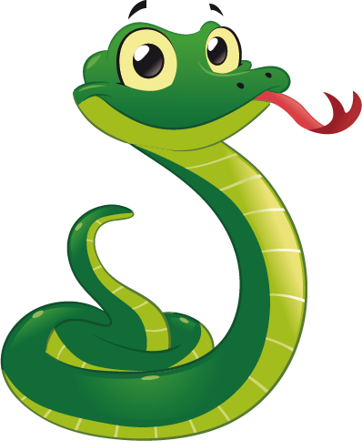

# Snakes and Ladders


#### Vector Designed By Eliana Couto


## Task

Feature One of the Snakes and Ladders Kata at 
<a href="http://agilekatas.co.uk/katas/SnakesAndLadders-Kata">Agile Katas</a>: 
```
The first feature we want implemented is the ability to move your token across the board using dice rolls. 
Players will need the ability to roll a dice, move their token the number of squares indicated by the dice roll 
and should win if they land on the final square
```

## User Stories

```
Token Can Move Across the Board:

As a player
I want to be able to move my token
So that I can get closer to the goal
```

```
Moves Are Determined By Dice Rolls:

As a player
I want to move my token based on the roll of a die
So that there is an element of chance in the game
```

```
Player Can Win the Game: 

As a player
I want to be able to win the game
So that I can gloat to everyone around
```


## Tests

1. Clone the repository: `git clone https://github.com/marshall159/snakes_and_ladders`

2. Change into the new directory: `cd snakes_and_ladders`

3. Install <a href="https://bundler.io">Bundler</a> if required 

4. Run `bundle` to install dependencies

5. Run `rspec` to start the testrunner


## Approach

I designed the project using a Behavioural Driven Development approach. Feature tests were used to guide the 
process of writing unit tests and only then application code. Minimal code was written to pass the tests and then 
refactored (red/green/refactor). I decided to use Ruby and RSpec in order to make the code, and specifically the 
feature tests, as readable as possible 

Due attention was paid to good Object-Oriented Design. SOLID principles were adhered to, mostly the Single 
Responsibility Principle and Dependency Inversion due to the limited scope of the project. Care has been taken so that 
each class adheres to principles of encapsulation. Each class allows access to what is necessary and hides all other 
data and methods

The classes have a single responsibility and contain methods that also have a single responsibility. The methods are 
short and concise, between 1 and 3 lines. Following a TDD process, writing tests first, has ensured the methods have 
a clearly defined responsibility which is also made clear in the method's names. 

The Die and Player classes have no dependencies

The Game class depends on an object which responds to the :name message but does not require it to strictly be a 
Player class. The Player dependency is currently being injected in to ease the initialization with a default and 
allow testing with a mock Player object

Game class also depends on an object which responds to the :roll message but not strictly the Die class. A default die 
object is being injected which allows us to easily test the random behaviour of the die object. Care was also
taken to limit the dependency on positional arguments to each class and method. Instead, mostly I have used default 
arguments and named arguments in the form of a hash/dictionary to overcome this dependency 

By making an effort to limit dependencies, the classes are easier to reuse and are more flexible for changing 
requirements. Good design does not matter for applications that do not change, however, this project has further
features which will require the classes to cooperate and be extended

A key design decision I made early on was to have most of the logic in the Game class. The alternative would have been 
to model the domain, using UML, and then have each class have its own responsibility. Either approach would have 
worked here on this project, however, I considered it easier with the limited time to have the logic in the Game class
and extract out any classes when required to avoid the Game class becoming a God class


## Extensions

If the project were slightly larger than an interaction of simplistic objects, the first thing I would do is set up a 
production grade pipeline with a proper branching strategy, continuous integration and code coverage. I determined with 
the limited time it would be more appropriate to focus on the Object-Oriented Design instead

I finished the first set of features by extracting out the Player class and the next task would be for me to extract 
further logic from the Game class into a Board class. Currently Game uses a far too simplistic increment of the token
variable. This was the easiest way to meet the initial requirements using TDD, however, this would not allow extension
of the project and further progress on the other features. Instead a Board class would contain a more complex data 
structure such as a nested array. This would also allow a Token class to be extracted to be placed as an element in the 
Board structure and then have the token object moved by calls to the die object. This would allow further features 
such as Snakes and Ladders to be easily implemented and stored as elements of the array. This would also allow 
multiple players and tokens to populate the same board

Currently the project is not completely robust and requires the correct input, for example in the Player class. I 
would implement more robust error handling to satisfy any edge cases

The design decisions I made early on with classes being easy to reuse would easily allow this project to be extended to
be used as the logic of a minimalistic backend. An alternative extension would be to include a script to allow the 
code to be played in the command line
